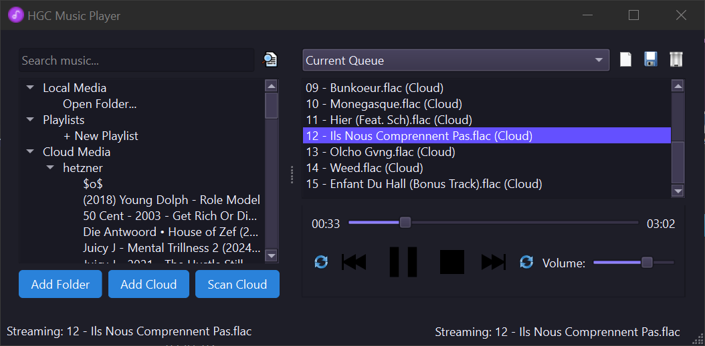

# HiCloud MP - Cross-Platform Music Player

A personal project born from the need for a lightweight music player with robust WebDAV integration, designed to seamlessly sync with cloud storage services.

A powerful, modern music player with support for local and cloud-based music libraries.


## Screenshot



## Features

✨ **Unified Music Library** - Access all your music in one place
- 🎵 Local files and folders
- ☁️ Cloud storage (WebDAV, Dropbox)
- 🔍 Powerful search across all sources

🎧 **Playback Features**
- 📋 Playlist management (create, save, edit)
- 🔄 Repeat and shuffle modes
- 🎚️ Volume control
- ⌨️ Media key support (play/pause, next, previous)
- 🔍 Progress tracking and seeking

☁️ **Cloud Integration**
- 🌐 WebDAV support (Nextcloud, OwnCloud, etc.)
- 📦 Dropbox integration
- 🔜 Google Drive and OneDrive (coming soon)

🎨 **Modern UI**
- 🌙 Dark theme with sleek purple-blue accents
- 📱 Responsive design

## Installation

### Requirements
- Python 3.x
- PySide6
- Additional libraries (see below)

### Setup

1. Clone the repository:
```bash
git clone https://github.com/yourusername/HiCloud-MP.git
cd HiCloud-MP
```

2. Set up a virtual environment (recommended):
```bash
python -m venv venv
# On Windows:
venv\Scripts\activate
# On macOS/Linux:
source venv/bin/activate
```

3. Install dependencies:
```bash
pip install PySide6 webdavclient3 dropbox sounddevice soundfile
```

4. Run the player:
```bash
python main.py
```

## Usage

### Adding Local Media
1. Click "Add Folder" or "Add Files" to add music to your library
2. Browse to select your music files or folders
3. Choose whether to add to your library or directly to a playlist

### Adding Cloud Accounts
1. Click "Add Cloud" to add a cloud storage account
2. Select the cloud service type (WebDAV, Dropbox)
3. Enter your credentials
4. Click "Scan Cloud" to discover your music files

### Creating Playlists
1. Add tracks to the current queue
2. Click "New Playlist" or use the dropdown menu
3. Enter a name for your playlist
4. Click "Save Playlist"

### Playback Controls
- Use the transport controls (play/pause, next, previous)
- Adjust volume with the slider
- Use media keys on your keyboard for control from anywhere

## Configuration Files

The player stores settings in the following files:
- `mediafolders.json` - List of local media folders
- `cloudfiles.json` - Cloud account settings and cached file lists
- `playlists.json` - Saved playlists

## Supported Formats

- MP3 (.mp3)
- FLAC (.flac)
- WAV (.wav)
- OGG (.ogg)
- AAC (.aac)
- M4A (.m4a)
- WMA (.wma)

## License

MIT License

## Contributing

Contributions are welcome! Please feel free to submit a Pull Request.
